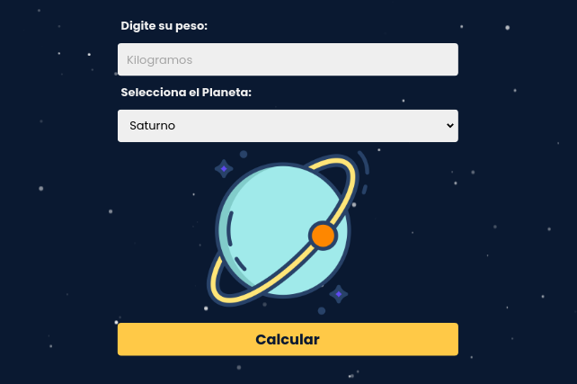
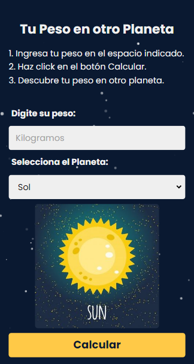

# Balanza de mundos 💻
## Description 📚
 Pequeña aplicación que utiliza JavaScript que te permitirá conocer lo que pesarías en Marte, Júpiter o incluso en la Luna. Sólo tienes que introducir lo que pesas aquí en la Tierra y pulsar sobre el botón de calcular, así conocerás automáticamente cómo influye la gravedad de cada uno de los planetas sobre tu masa.
Las validaciones son hechas con código nativo sin el uso de librerías externas. 
 
 
## Frontend Development 🌞 
     
 
 
## Tools 🎨 
 

## Desktop

## Mobile

## Créditos

Diseñado por Carlos Robertiz
