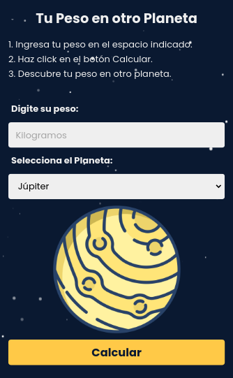

# Tu Peso en otro Planeta

Esta es una pequeña aplicación que utiliza JavaScript que te permitirá conocer lo que pesarías en Marte, Júpiter o incluso en la Luna. Para ello sólo tienes que introducir lo que pesas aquí en la Tierra y pulsar sobre el botón de calcular, así conocerás automáticamente cómo influye la gravedad de cada uno de los planetas sobre tu masa.

## Desktop

## Mobile

## Créditos

Diseñado por Carlos Robertiz
